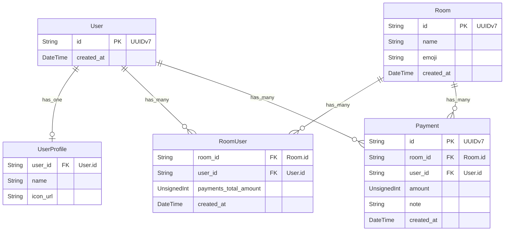

# ER Diagram

```mermaid
erDiagram
  User {
    String id PK "UUIDv7"
    DateTime created_at
  }

  UserProfile {
    String user_id FK "User.id"
    String name
    String icon_url
  }

  Room {
    String id PK "UUIDv7"
    String name
    String emoji
    DateTime created_at
  }

  Payment {
    String id PK "UUIDv7"
    String room_id FK "Room.id"
    String user_id FK "User.id"
    UnsignedInt amount
    String note
    DateTime created_at
  }

  RoomUser {
    String room_id FK "Room.id"
    String user_id FK "User.id"
    UnsignedInt payments_total_amount
    DateTime created_at
  }

  Room ||--o{ RoomUser : "has_many"
  Room ||--o{ Payment : "has_many"
  User ||--o| UserProfile : "has_one"
  User ||--o{ RoomUser : "has_many"
  User ||--o{ Payment : "has_many"
```
